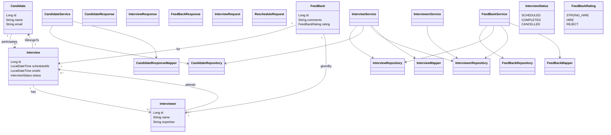

# 📌 Interview Management System

A **Spring Boot 3.5 + Java 21** based backend application to manage interviews, candidates, interviewers, and feedback.


---

# 🚀 Features

## 👤 Candidate Management
- Create candidate
- Get candidate by ID

## 👨‍💼 Interviewer Management
- Create interviewer
- Get all interviewers

## 📅 Interview Management
- Schedule interview
- Update interview status
- Reschedule interview
- Search interviews with:
- Candidate name
- Interviewer name
- Date range
- Pagination

## Feedback Management
- Submit feedback
- Store rating and comments
- Validate interviewer assignment

---

# 🧠 Key Design Highlights

- Modular Monolith Architecture**
- SOLID Principles**
- based API design**
- MapStruct for mapping**
- Specification pattern for dynamic filtering**
- Global Exception Handling**
- Pagination & Search**
- Swagger (OpenAPI) Documentation
- Unit Testing with Mockito

---

# 🛠️ Tech Stack

- **Java 21**
- **Spring Boot 3.5**
- Spring Data JPA
- Hibernate
- H2 Database
- MapStruct
- Lombok
- Swagger (springdoc-openapi)
- JUnit 5 + Mockito
- Liquibase

---

# ⚙️ Setup & Run

## 1️⃣ Clone the repository
```bash
git clone https://github.com/Balaji08/interview-management.git
cd interview-management
```

##  2️⃣ Build the project
mvn clean install

## 3️⃣ Run the application
mvn spring-boot:run


## 🗄️ Database
Uses H2 in-memory database
Console:
http://localhost:8080/h2-console

## 📄 API Documentation
Swagger UI
http://localhost:8080/swagger-ui/index.html

## OpenAPI Docs
http://localhost:8080/v3/api-docs

## 📌 API Endpoints
## Candidate
POST /api/v1/candidates
GET /api/v1/candidates/{id}

## Interviewer
POST /api/v1/interviewers
GET /api/v1/interviewers

## Interview
POST /api/v1/interviews
GET /api/v1/interviews
PATCH /api/v1/interviews/{id}/status
PATCH /api/v1/interviews/{id}/reschedule

## Feedback
POST /api/v1/interviews/{interviewId}/feedback

## ⚠️ Business Rules
Interview cannot be scheduled if time conflict exists
Conflict ignores CANCELLED interviews
Only SCHEDULED interviews can be rescheduled
Status transitions are restricted
Feedback allowed only for assigned interviewer

## 🧪 Testing

Run tests:

mvn test

## Covered Areas
Service layer logic
Validation scenarios
Exception handling
Search & pagination


## 🔥 Enhancements Implemented
Dynamic filtering using Specification
Clean API response wrapper
Centralized exception handling
MapStruct-based DTO mapping
Swagger documentation

## 🚀 Future Improvements
JWT Authentication & Authorization
Event-driven notification (async)
Caching (Redis)
Microservices architecture
Docker support

## ‍💻 Author

Balaji V S

